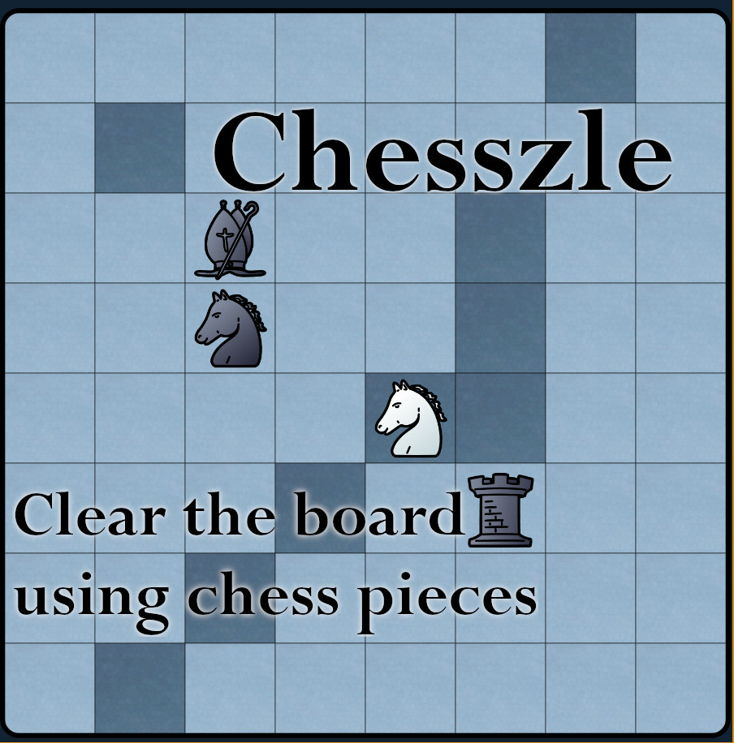

# Chesszle

A chess-inspired puzzle game. 15 levels. Can be completed in ~30 minutes.

Published here: https://laurentlb.itch.io/chesszle



## Hidden level editor

To create a level:
1. Open this page: https://laurent.le-brun.eu/games/chesszle/
2. Open the JS console
3. Execute this command (adjust the list of pieces as needed):

```js
editor([{type: "rook", x: 0, y: 0}, {type: "bishop", x: 2, y: 3}, {type: "knight", x: 4, y: 4}]);
```

4. Move pieces (execute the solution)
5. Execute this command to get your level as JSON:

```js
editorSave();
```

6. To load a level and try it, run `loadLevel` with the JSON:

```js
loadLevel({"id": ...});
```
